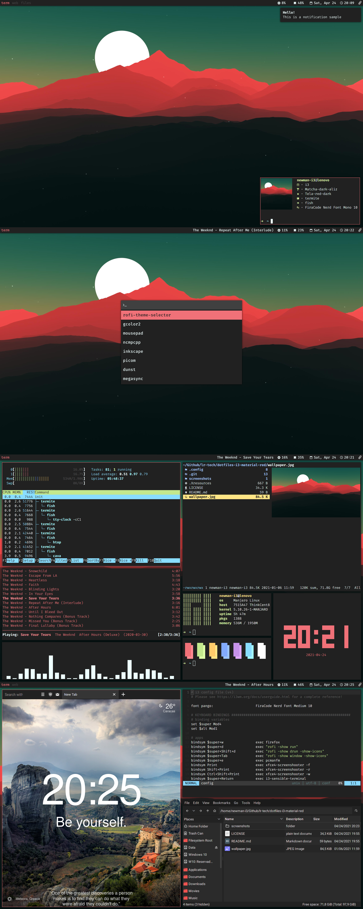

# [i3-gaps] Material Red Dotfiles

- WM: i3-gaps
  - Font: FiraCode Nerd Font Medium/Roboto
  - Terminal: Termite
    - Shell: Fish
    - Font: FiraCode Nerd Font Mono
    - Fetch: Neofetch/Pfetch
    - Task Manager: Htop
    - Music Player: NCMPCPP
    - Visualizer: Cava
    - File Manager: Ranger
    - Clock: tty-clock
    - Colorscript: panes (from shell-color-scripts (AUR))
    - Editor: Neovim
  - Launcher: [Rofi (squared red theme)](https://github.com/lr-tech/rofi-themes-collection)
  - GTK Theme: [Matcha Dark Aliz](https://github.com/vinceliuice/Matcha-gtk-theme)
  - Icons: [Tela red dark](https://github.com/vinceliuice/Tela-icon-theme)
  - Web Browser: Firefox
    - userChrome.css: [quietfox (oneline modified)](https://github.com/coekuss/quietfox)
    - Theme: [Material Darker - VS Code](https://addons.mozilla.org/en-US/firefox/addon/material-darker-vs-code/)
    - Startpage: [Momentum](https://addons.mozilla.org/en-US/firefox/addon/momentumdash/)
  - File Manager: PCManFM
  - PDF Reader: Zathura (mupdf)
  - Notifications: Dunst
  - Clipboard Manager: xfce4-clipman
  - Screenshooter: xfce4-screenshooter
  - Visual Settings Manager: LXAppearance/qt5ct
